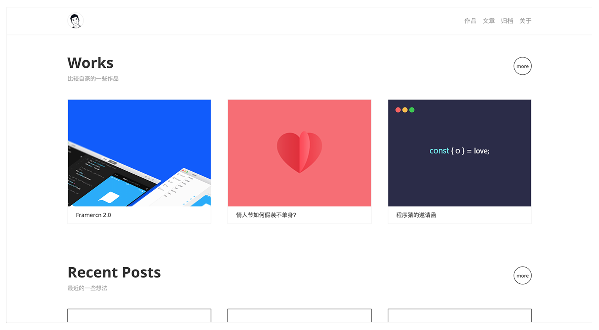
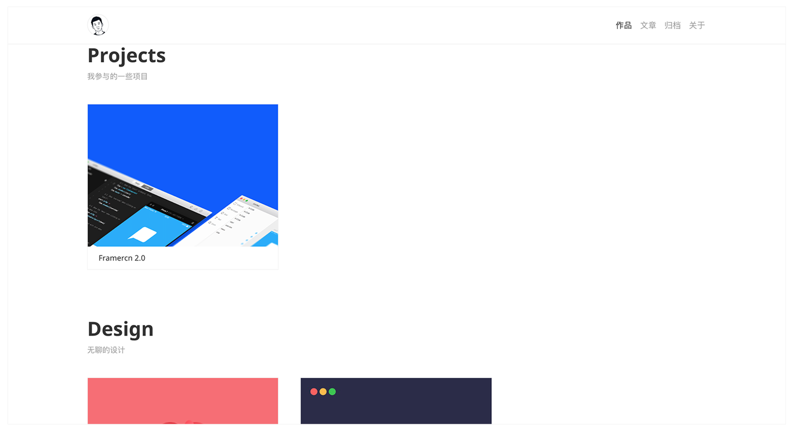

# hexo-theme-juuust

一款适用于设计师的 hexo 主题。

## 一览


## DEMO
demo：[leadream.github.io](https://leadream.github.io)
我的博客：[Juuust](http://juuust.com)（做了一些定制）

## 博客源码示例
完整博客示例：https://coding.net/u/leadream/p/hexo-theme-juuust/git（clone 下来源码直接可用）

## 使用
1. 在你的 hexo 博客根目录执行如下命令:
```git
$ git clone https://github.com/leadream/hexo-theme-juuust.git themes/juuust
$ npm install --save hexo-renderer-sass
```

2. 把 `config.yml` 中的 `theme` 改成 `juuust`
```yml
# theme: landscape
theme: juuust
```

3. 运行: `hexo s`

## 文档
你可以在 `config.yml` 书写配置项来覆盖主题默认配置。

#### 1、基本配置
这些配置项主要是博客的一些基本信息和 logo 。
```yml
title: Juuust
subtitle: 好奇心大于一切
favicon: /images/favicon.ico
logo: /images/header-avatar.png
```

#### 2、导航
这是右上角的导航链接，
```yml
nav:
  about: about
  archive: archives
  page: page
  works: works
```

#### 3、首页
这是首页的配置，首页分为两部分——上面的精选作品和下面的最近更新文章。`hero` 就是精选作品的配置，`recent` 是下面的最近更新文章配置，每一个之中 `title` 标题，`brief` 是简短介绍。
```yml
home:
  hero:
    title: Works
    brief: 比较自豪的一些作品
  recent:
    title: Recent Posts
    brief: 最近的一些想法
```

#### 4、关于页面
这是关于页面的图片配置，`hero` 是图片链接，`hero_width` 是图片宽度。
```yml
about:
  hero: /images/hero.jpg
  hero_width: 160
```

#### 5、社交媒体
这些是社交媒体的配置，目前支持以下 6 种。**注意：`weixin` 的链接是公众号二维码图片链接，直接展示二维码，不写这一项就不会显示二维码。**
```yml
social:
  weixin: /images/weixin-qrcode.png
  dribbble: https://dribbble.com/leadream
  behance: https://github.com/leadream
  zcool: https://leadream.zcool.com.cn/
  github: https://github.com/leadream
  mail: mailto:leadream4@gmail.com
```

#### 6、精选作品


就像最上面的截图一样，你可以选择 3 个最想展示给别人的作品放在首页。只需要在你博客的 `source/_data/heroes.yml` 中按照下面的格式书写配置就可以了。

```yml
Projects:
  brief: 我参与的一些项目
  posts:
    -
      title: Framercn 2.0
      link: /2017/framercn/
      pic: /images/post/framercn/cover.png
Design:
  brief: 无聊的设计
  posts:
    -
      title: 情人节如何假装不单身？
      link: /2017/love/
      pic: /images/post/love/cover.png
    -
      title: 程序猿的邀请函
      link: /2017/invitation/
      pic: /images/post/invitation/cover.jpg
    -
      title: 小雅日历
      link: /2017/xiaoya/
      pic: /images/post/xiaoya/cover.jpg
```

从上面的配置中可以看到，你的作品可以被分类（如上面的是 `Projects` 和 `Design` 两类）。同时，最靠前的三个作品就会显示在首页，而通过 `你的博客域名/works` 可以访问作品主页。

#### 7、作品 DEMO
你可以在每一篇文章的 markdown 文件中添加 `demo` 来指定某篇文章对应的作品链接。

你可以写一个链接（ PC 端网站）：

```md
---
title: Framercn 2.0 
date: 2017-11-05 21:14:38
demo: <h4><a href='http://framercn.com' target='_blank'>http://framercn.com</a></h4>
tags:
---
```

也可以放一张二维码（移动端网站、小程序）：

```md
---
title: 程序猿的邀请函
date: 2017-06-06 22:56:03
demo: 
tags:
---
```
